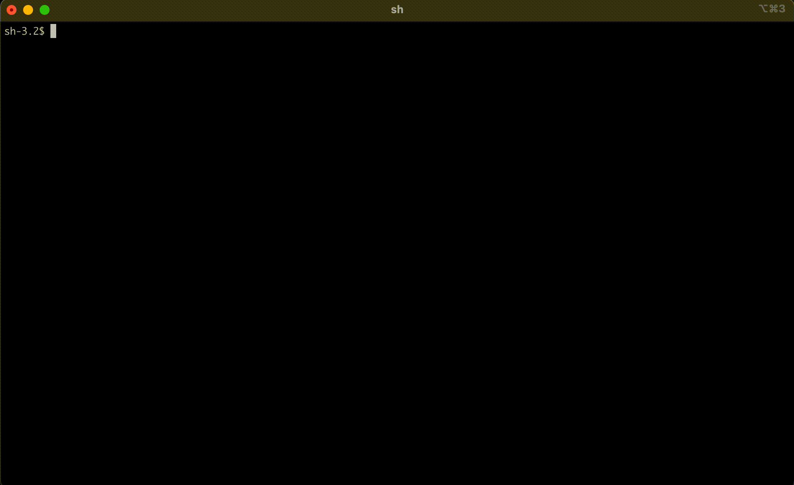

# npm-secure-installer

A secure global installer for Npm, only whitelisting packages which use npm-shrinkwrap to lock down dependencies and avoid supply-chain attacks.

One of the key requirements of SLSA is dependency hermetic, meaning the dependencies are locked down to an immutable reference.
Npm achieves this goal using the package-lock.json which is automatically created on the first "npm install" run.
However, when using Npm to install global tools, Npm does not run from any project and therefore does not use any package-lock.json file.\
Moreover, even if the package to be installed had a package-lock.json, it has no effect in this scenario.
Thankfully, npm provides the shrinkwrap approach which is specifically designed for this scenario.

So, the secure approach will be to verify the package has npm-shrinkwrap manifest before performing the installation.
npm-secure-installer will do just that.

This tool was inspired by the recent "colors" fiasco.

### Usage:
    npm-secure-installer [PACKAGE-NAME]

