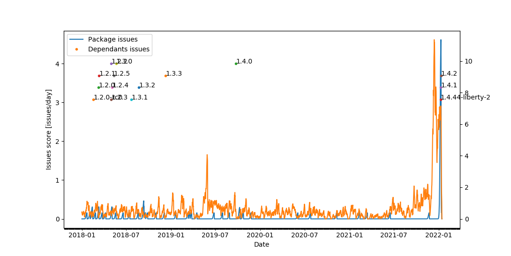
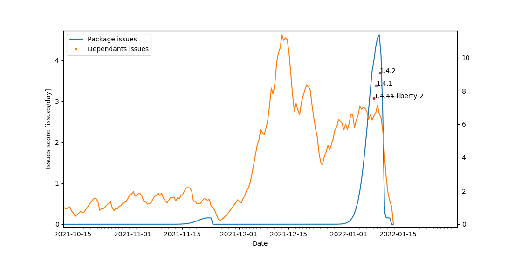

# GitHub Issues as indication for faulty `npm` package upgrades

## Intro

Breaking changes in dependencies, either due to malicious intent, as in case with [`colors`](https://www.bleepingcomputer.com/news/security/dev-corrupts-npm-libs-colors-and-faker-breaking-thousands-of-apps/), or due to mistakes, happen from time to time. We would like to be able to detect these events, however, in both cases, there is little common denominator to possible root causes. Breaking/malicious changes can happen in different ways, and except for extreme (and probably rare) cases, it is hard to define a rule for such changes which will not be triggered by benign changes as well. It seems like the only certain outcome from a breaking change in a package will be problems in packages which depend on it.

In the following experiment, we propose just that as a possible indicator for problematic version updates of libraries: let's try to observe creation of GitHub issues in projects depending on a given package in the days following a version update. For a popular enough library, the number of dependent projects might be large enough so that the surplus issues resulting from a breaking change will be significant with respect to the "background" issues which are unrelated to the change.

## Set-up

The requirements are installed by

```
pip install -r requirements.txt
export GITHUB_TOKEN=<GITHUB_TOKEN>
```

## Implementation

The code goes through the following steps:

* History of published versions of `package` is fetched from npm
* We use  `npm_packages_data.pcl`, which contains data about ~2500 most used npm packages fetched from `registry.npmjs.org`, including the mapping between the packages and their GitHub repository URLs. Using this dataset, we obtain the GitHub repositories corresponding to `package` and a list of packages which depend on it.
* A list of timestamps for issue creation of `package` itself is fetched from GitHub over GraphQL API
* A list of timestamps for issue creation of each depending package is fetched from GitHub over GraphQL API
* The interesting quantity is the "score" - our estimate on the possibility of each version update triggering a surplus of issues. It is calculated as a convolution of issue timestamps with a "[matched filter](https://en.wikipedia.org/wiki/Wiener_filter)" - a Gaussian with width of 5 days, peak 2 days before the time of the issue, and zeroed after the issue timestamp.
* The results (for the issues of the package itself and the depending packages) are plotted

## Results

```
python package_issues_history.py colors --start_date="2018-01-01"
```

Generates the following:





In this case, the pattern is clear: none of the previous updates (colored dots labeled with the version numbers) coincide with a significant increase in the number of created issues in both the library itself and its depending libraries, which hints that we could potentially have discovered this case by observing the issues opened in other projects. Theoretically, it may even be possible to realize that a number of issues opened in different projects come from the same common cause, before the issues are debugged and the cause is located. 

While this idea is rather raw, we publish the source code for others to experiment with, for the benefit of further research on finding better ways to monitor the health of the ecosystem, and quickly finding new threats.

